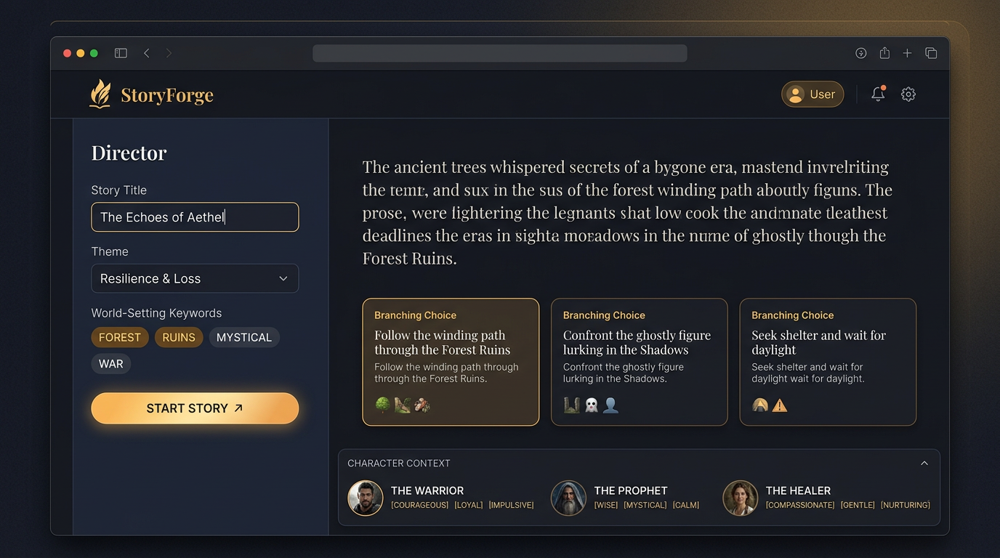
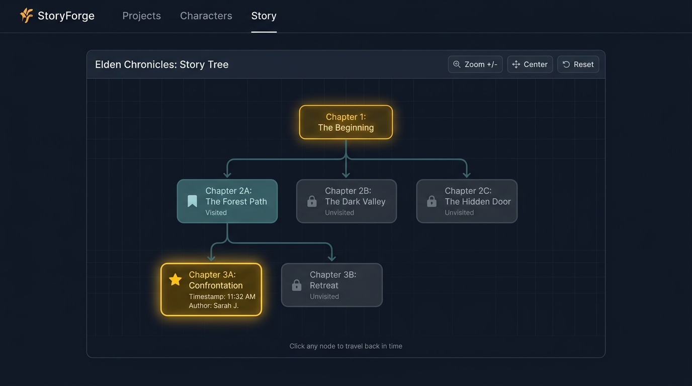
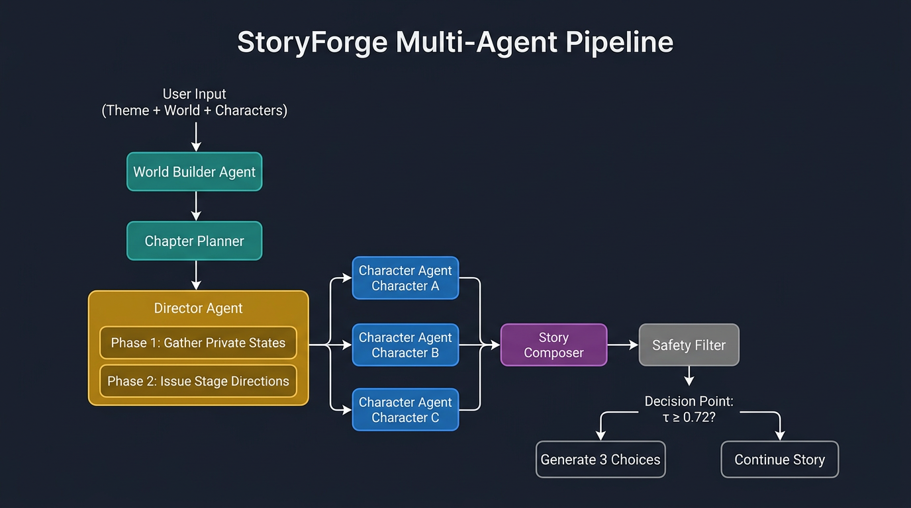

<div align="center">
  

  # StoryForge
  ### Multi-Agent Branching Story Generator

  > An expressive writing therapy tool powered by multi-agent AI collaboration.

  [](https://python.org)
  [](https://flask.palletsprojects.com)
  [](LICENSE)
  [](https://platform.openai.com)
</div>

---

StoryForge is an interactive AI story creation platform rooted in **expressive writing therapy** — the evidence-based practice of using narrative to process emotions, reframe lived experiences, and foster psychological healing.

A **Director Agent** guides the emotional arc of the story while multiple **Character Agents** collaborate in real time, giving voice to different inner perspectives. This mirrors therapeutic techniques where externalizing internal conflicts through fictional characters builds self-awareness and emotional distance from personal pain.

Unlike linear generators, StoryForge turns every chapter into a **branching decision point**. Three distinct paths appear after each chapter. Users can choose a direction, or backtrack through the visual **Story Tree** to explore alternate outcomes — reflecting the therapeutic belief that stories, like lives, can always be re-authored.

---

## Screenshots

### Main Interface



*Director panel (left) · Story content with branching choices · Character Agents bar (bottom)*

### Story Tree — Visualize Every Branch



*Click any node to travel back in time and re-author your story from that point.*

### Multi-Agent Pipeline



*World Builder → Chapter Planner → Director Agent (2-phase) → Character Agents → Story Composer → Tension-based Decision Point*

---

## ✨ Features

| Feature | Description |
|---------|-------------|
| **AI-assisted setup** | Generate title, theme, and world-setting from keywords |
| **Multi-agent collaboration** | Director + Character Agents negotiate plot in real time via SSE streaming |
| **Branching choices** | 3 AI-generated continuations after every chapter |
| **Story Tree** | Interactive SVG tree showing all paths; click any node to backtrack |
| **Memory Mode** | Childhood questionnaire → AI builds a nostalgic world to re-author positive memories |
| **Keyword picker** | World-building tags organized by Environment, Atmosphere, Era, and Special Elements |
| **Draggable layout** | Resize left/right panels and the character bar freely |
| **Provider flexibility** | OpenAI, Anthropic Claude, and Google Gemini |
| **Export** | Download your full story as a `.txt` file |

---

## 🧠 How It Works

StoryForge uses a **multi-agent pipeline** where specialized AI agents collaborate on each chapter:

1. **World Builder** — Constructs a structured world (name, locations, atmosphere, therapeutic elements) from your theme and keywords.
2. **Chapter Planner** — Outlines a high-level arc for the upcoming chapter.
3. **Director Agent** *(two phases)*
   - **Phase 1 – Gather Private States:** Elicits each character's inner desires, fears, and secrets — visible only to the Director.
   - **Phase 2 – Direct the Scene:** Issues per-character stage directions (emotional beat, physical action, subtext).
4. **Character Agents** — Each character generates public action, private thought, dialogue, and emotional state, conditioned on the Director's instructions.
5. **Story Composer** — Weaves all character outputs into literary prose (Denis Johnson / Ishiguro style: concrete events, distinct voices).
6. **Safety Filter** — Optional pass to downrank harmful or anti-therapeutic content.
7. **Decision Point** — When scene tension `τ ≥ 0.72`, the chapter closes and three branch choices are generated for the user to steer the story.

### Memory Mode

Users fill a short form (hometown, best friend, favourite place, happy memory, season…). StoryForge builds a `theme` and `custom_setting` from those answers, generates 3 characters, and runs the **same pipeline** — letting users relive and re-author positive memories.

---

## 🗂 Project Structure

```
Expressive-Writing-Therapy/
├── index.html              # Frontend (single-file, no build step)
├── images/                 # Screenshots and diagrams
│   ├── banner.png
│   ├── ui-main.png
│   ├── story-tree.png
│   └── architecture.png
└── backend/
    ├── run.py              # Flask entry point (port 5001)
    ├── requirements.txt
    └── app/
        ├── api/
        │   ├── story.py    # Story generation + SSE streaming
        │   └── config.py   # Dynamic LLM configuration
        ├── models/         # Story, Chapter, Character data models
        ├── services/       # Director / Character agent logic
        └── utils/
            └── llm_client.py
```

---

## 🚀 Getting Started

### Prerequisites

- Python 3.10+
- A modern browser (Chrome / Safari / Firefox)
- An API key from one of: [OpenAI](https://platform.openai.com/api-keys), [Anthropic](https://console.anthropic.com/keys), or [Google AI Studio](https://aistudio.google.com/app/apikey)

### 1. Clone the repository

```bash
git clone https://github.com/ChuanBuJianRi/Expressive-Writing-Therapy.git
cd Expressive-Writing-Therapy
```

### 2. Start the backend

```bash
cd backend

# Create and activate a virtual environment
python3 -m venv venv
source venv/bin/activate        # macOS / Linux
# venv\Scripts\activate         # Windows

# Install dependencies
pip install -r requirements.txt

# Start the Flask server
python run.py
```

The backend runs at **http://localhost:5001**. Keep this terminal open while using the app.

> **Every time you restart your machine**, run:
> ```bash
> cd backend && source venv/bin/activate && python run.py
> ```

### 3. Open the frontend

```bash
open index.html          # macOS
# Or drag index.html into any browser window
```

### 4. Configure your AI provider

On first launch, a setup modal appears automatically:

1. Select your AI provider (OpenAI / Anthropic / Google)
2. Paste your API key
3. Choose a model
4. Click **Start Creating**

Settings are saved in `localStorage` and synced to the backend on each session start.

---

## 🖥 Usage

1. **Director panel** — Enter a story title, theme, and world setting (use the keyword picker or AI suggestions)
2. **Configure characters** — Edit names, roles, and personalities in the Character Agents bar
3. **Options** — Choose model, chapter length (Brief / Medium / Detailed), and creativity level
4. **Start Story** — Agents collaborate to generate Chapter 1 via live SSE streaming
5. **Pick a branch** — Three choices appear after each chapter; select one to continue
6. **Story Tree** — Switch to the Story Tree tab to see all branches; click any node to restore that chapter
7. **Export** — Click Export in the header to download the full story

---

## 🔌 API Endpoints

| Method | Endpoint | Description |
|--------|----------|-------------|
| `POST` | `/api/story/start` | Initialize a new story session |
| `POST` | `/api/story/generate-chapter` | Stream chapter generation (SSE) |
| `POST` | `/api/story/generate-choices` | Generate 3 branch options for next chapter |
| `POST` | `/api/story/suggest` | AI suggestions for title / theme / keywords |
| `GET`  | `/api/story/status/<id>` | Get session status |
| `GET`  | `/api/story/export/<id>` | Export full story text |
| `POST` | `/api/config/llm` | Update LLM provider / key / model |
| `GET`  | `/api/config/llm` | Get current LLM configuration |
| `GET`  | `/health` | Health check |

---

## 🛠 Tech Stack

| Layer | Technology |
|-------|-----------|
| Frontend | Vanilla HTML / CSS / JS (no framework, no build) |
| Backend | Python · Flask · Flask-CORS |
| Streaming | Server-Sent Events (SSE) |
| LLM | OpenAI SDK (compatible with Anthropic & Google via `base_url`) |
| State | In-memory session store + `localStorage` |

---

## 💡 Inspiration

Expressive writing therapy has strong empirical backing — structured reflective writing reduces rumination, improves emotional regulation, and even supports physical health. StoryForge scales that process by turning it into a **collaborative stage**: multiple AI agents act out a story *with* the user, so that *choosing* what happens next becomes part of the therapeutic work.

The tool also functions as a **citizen's storytelling kit**: a tale set in a dying forest makes climate loss tangible; a ground-level war narrative conveys futility and human cost; an allegorical world (in the spirit of *Animal Farm*) lets users explore power, inequality, or injustice through character and choice — without preaching.

---

## 📄 License

MIT License — see [LICENSE](LICENSE) for details.
